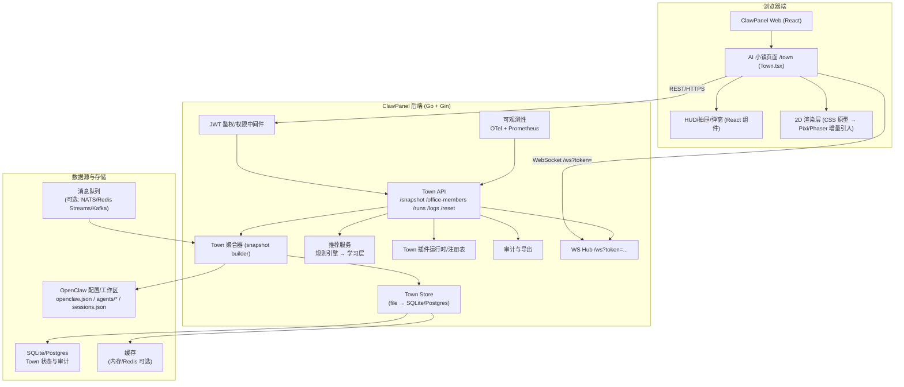
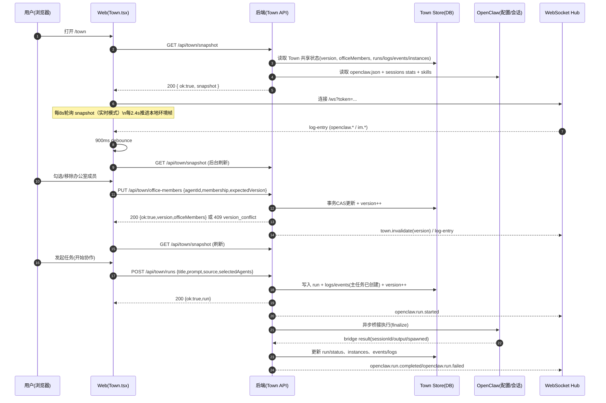
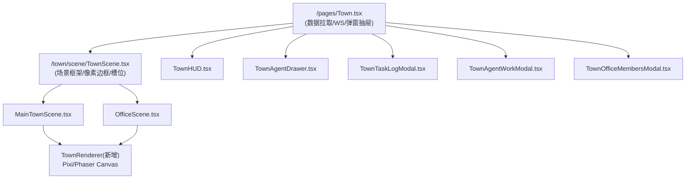
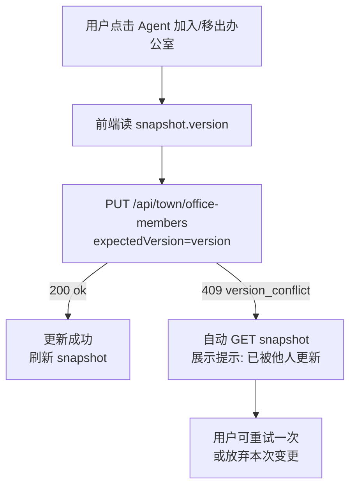

# AI 小镇升级版设计文档

## 执行摘要

“AI 小镇”在 ClawPanel 中的定位应继续严格遵循现有 V3 设计原则：它是 **OpenClaw 的协作观测皮肤**，不发明新的 Agent 系统与任务系统，所有真实语义应优先来自 OpenClaw + ClawPanel 的既有接口与运行态；Town 只做聚合、映射、可视化与轻量操作。该边界在现有 V3 设计稿中已明确，并给出固定路由 `/town`、双场景（主镇/办公室）、快照优先（`GET /api/town/snapshot`）与 WS 仅触发刷新等约束。 citeturn9view0turn10view3turn29view0

本升级版设计文档将 “可直接指导工程交付” 作为第一目标，核心升级点聚焦在三条主线上：  
其一，将当前以 `town_state.json` 为主的共享状态持久化（含办公室成员池、runs/logs/events/instances、单调递增 version 与审计）迁移到 **SQLite/Postgres（主推荐）**，提供可回滚的数据迁移与双写/灰度策略，解决多人并发写入、可观测与保留策略难以治理的问题；现有后端确实以 `DataDir/town_state.json` 与 `town_office_audit.jsonl` 落盘，并以进程级互斥 + `expectedVersion` 做 CAS（乐观并发）控制。 citeturn11view5turn12view3turn14view0turn10view3  
其二，将前端从 “React + CSS 像素原型” 平滑升级为 “React UI + Canvas/WebGL 渲染层（Pixi/Phaser 增量引入）”，保持现有组件边界（Town 容器 / Scene / HUD / Drawer / Modal）不被破坏，避免一次性重写导致语义丢失；Town 模块 README 已明确当前采用 React + CSS 先映射状态层再考虑更重渲染层。 citeturn27view0turn23search0turn23search1  
其三，建立 **“调度可观测 + 推荐/匹配 + 插件/市场” 的最小闭环**：Town 不只是看到“谁在忙”，还要能看到 `OpenClaw(main)` 调度起了哪些 Agent、整个执行是并行还是串行、每个 Agent 的运行时间、调度理由、plan 计划，以及命令/skills 调用轨迹；这些关键动作还应能在场景中通过小人聊天水泡实时提示。当前项目不再按 `MVP / Beta` 切阶段承诺，而是按完整项目开发，但执行顺序仍坚持“先基础底座与安全，再调度观测与体验，再治理与扩展”。对于 plan、调度理由、拓扑、命令与 skills 轨迹，只接受真实上游数据；若 OpenClaw 未提供，Town 必须明确显示“暂无数据/上游未提供”，不能做近似推断。对于命令、prompt、LLM 原文与 command/skill/tool 内容，当前项目采用“原文直显”决策：不做脱敏、不做语义摘要改写，只在布局层允许折叠、换行或长度裁剪。Town V3 已定义统一事件规范与“回放冻结实时”的机制，可直接作为推荐、调度解释与风控的数据底座。 citeturn10view1turn10view2turn30view2turn29view0

交付节奏建议采用三条工作流并行排期：`基础底座与安全`、`调度观测与产品体验`、`治理与扩展`。其中当前项目直接覆盖前两条主线，企业级 RBAC、多租户、插件市场治理等结构性增强保留为后续扩展。 citeturn10view4turn23search7turn23search6

## 假设与非目标

本项目存在多个“未指定”前提，需要先显式假设，避免工程实现方向漂移；下列假设均可在立项评审时替换，但替换会直接影响数据库与权限模型设计。

假设用户规模未指定：当前项目默认按 **单实例单租户**、日活管理者 1–20、同时在线 1–5、每 24h 新增 run 0–200 的量级设计；因此可优先使用 SQLite/WAL 或单机 Postgres，不强制引入外部 MQ 与分布式缓存。若预计并发与事件量显著上升，应升级到 Postgres + 队列，并限制快照 payload 与事件回放上限（Town 回放已定义最多 2000 条事件）。 citeturn24search7turn30view2turn10view4

假设商业化未指定：当前项目默认按开源/自用交付，先实现“可观测 + 可治理 + 可扩展”；若后续商业化，则需要再引入账号体系、计费边界、插件市场分成与内容审核机制，并将审计与数据保留策略产品化。 citeturn23search7turn23search6

假设企业级合规未指定：当前项目保留基础工程安全原则（最小权限、可审计、合理保留周期、鉴权和回滚），但内容层采用“原文直显”决策，不对命令、prompt、LLM 原文做脱敏；这意味着项目显式接受较高的数据暴露与合规风险，并默认运行在受信管理端环境。若要面向企业交付，应在后续扩展中重新引入更严格的 RBAC、审批流、KMS/密钥轮换、跨境/委托处理协议、以及更细的个人信息处理告知与同意管理。个人信息保护法对“个人信息的处理活动、适用范围、定义”等有明确规定，应作为后续企业化时的合规基线参考。 citeturn23search7

假设多租户支持未指定：当前项目默认不做多租户；若后续确认需要，所有 Town 持久化表必须增加 `tenant_id`（或 `workspace_id`）并参与主键/索引，WS 推送需做租户隔离，`expectedVersion` 也需变为“按租户维度的版本”。Town 现有契约与实现是“单调 version + 可选 expectedVersion CAS”，天然可扩展到多租户，但必须在数据层先做隔离。 citeturn10view3turn12view3

非目标：本升级**不**把 AI 小镇改造成“新的 Agent 配置中心/聊天产品”。Town V3 设计已明确它是观测皮肤，并强调不能定义另一套真实任务/成员/session 关系。 citeturn9view0turn10view2

## 交付主线与验收

### 功能范围总览

下表给出当前项目的三条交付主线与验收口径；验收标准尽量可度量、可自动化测试。

| 主线 | 目标 | 功能清单（必须） | 验收标准（关键） |
|---|---|---|---|
| 基础底座与安全 | 状态真、并发稳、可回滚 | DB 迁移（SQLite/Postgres）替代 `town_state.json`；保留 `GET /api/town/snapshot` “一次性渲染快照”契约；办公室成员池更新支持 `expectedVersion` 并返回 `409` 冲突；run 创建走真实桥接（保持 `POST /api/town/runs` 异步 finalize）；审计落库；指标/日志可观测；前端接入 expectedVersion 并做冲突提示/自动刷新 | 1）同一时刻 2 个管理端连续更新成员池，不出现静默覆盖：出现 `409` 并可自动恢复；2）快照默认 8s 轮询 + WS 触发刷新机制稳定；3）回放模式冻结实时刷新；4）出现 `town.disabled` 时前端展示明确提示（与现有一致）；5）可一键回滚到旧存储或从 DB 导出 JSON 还原 citeturn10view3turn14view0turn29view0turn9view0turn11view0 |
| 调度观测与产品体验 | 体验真、推荐准、可解释 | React UI 下增量引入 Pixi/Phaser 渲染层（不破坏现有组件结构）；调度可观测 UI 上线（plan、调度理由、并/串行拓扑、Agent 运行时长、命令/skills 气泡）；推荐/匹配规则引擎上线（可解释）；新增 `GET /api/town/recommendations`；WS 推送新增 `town.invalidate`（或等价）减少轮询压力；插件扩展点（只读/弱写）与签名/审核雏形 | 1）渲染层引入后，Town 页面交互/语义不回退：主镇/办公室、抽屉/弹窗、最大可见分区/成员等规则保持；2）用户能明确看出 run 是并行、串行还是混合执行，并看到每个 Agent 运行时长；3）调度面板只展示真实上游数据，缺失字段明确显示“暂无数据/上游未提供”；4）WS 触发刷新延迟 P95 < 1s；5）插件加载不允许任意脚本越权访问 token/文件系统 citeturn9view0turn23search0turn23search1turn24search1turn23search6 |
| 治理与扩展 | 企业化稳态、生态化 | 多租户（若需要）；细粒度 RBAC + 审批流；推荐学习层与 A/B 平台；插件市场（计费/分发/内容审核/供应链安全）；高可用部署方案 | 1）租户隔离可证明（数据/WS/导出）；2）安全基线对齐 OWASP Top 10；3）合规与保留策略可配置；4）可灰度/可回滚升级无数据丢失 citeturn23search6turn23search7turn25search0 |

### 关键产品不变约束

以下约束是“升级不得破坏”的产品边界：固定 `/town`、仅两场景、主镇最多展示 6 个可见 Agent、手动加入办公室上限 10、允许 0 成员由 OpenClaw(main) 单独发起、办公室是共享大厅、快照为最终一致数据源、WS 只触发刷新、回放冻结实时。 citeturn9view0turn10view3turn29view0turn30view2

## 系统架构与关键数据流

### 总体架构



架构与现状的对齐点：  
后端已存在 Town API 最小集合（`/api/town/snapshot`、`/api/town/office-members`、`/api/town/runs`、`/api/town/runs/:id/logs`、`/api/town/agents/:id/reset`）以及 TownSnapshot/TownSharedState 的数据结构定义，且成员池更新已支持 `expectedVersion` 语义；前端 `Town.tsx` 已实现 8s 周期拉取快照 + `/ws?token=` 监听 `log-entry` 后去抖刷新，并实现回放冻结逻辑。 citeturn10view0turn10view3turn19view0turn29view0turn30view2  
鉴权方面，ClawPanel API 文档明确除登录外接口使用 JWT，并通过 `Authorization: Bearer ...` 传递；WS 连接也采用 `?token=`。 citeturn8view2turn24search0turn24search1

### 关键数据流



该数据流与现有实现高度一致：前端的轮询周期（8s）、WS 触发刷新去抖（900ms）、环境帧推进（2.4s）与“回放冻结实时”均已在 `Town.tsx` 实现；后端快照构建、成员池更新、run 创建与 `expectedVersion` CAS 也已存在。 citeturn29view0turn14view0turn13view3turn10view3turn9view0

## API 契约与数据模型迁移

### API 端点与接口契约

#### 认证与权限模型

当前 ClawPanel API 采用 JWT Bearer（登录 `POST /api/auth/login` 后在 `Authorization: Bearer ...` 传递 token），Town 相关接口应延续此模型；RFC 7519 定义了 JWT 作为在双方间传递 claims 的紧凑 URL-safe 方式，可作为鉴权基础。 citeturn8view2turn24search0turn24search5  
WebSocket 协议本身的握手/安全模型可参考 RFC 6455，Town WS 建议继续复用 `/ws?token=` 并在服务端做 token 校验与 scope 授权。 citeturn24search1turn8view2turn29view0

本升级建议引入 **scope**（即使仍是单管理员），以便未来扩展：`town:read`、`town:write`、`town:run:create`、`town:agent:reset`、`town:recommendations`、`town:plugins`、`town:audit:read`。当前项目可先全部绑定到 admin，后续再拆 RBAC。该做法也便于对齐 OWASP Top 10 中“访问控制失效”等风险治理方向。 citeturn23search6

#### 端点契约表

下表列出**新增/变更**的 REST 与 WebSocket 契约（在保持现有 Town API 的前提下增强并发、推荐与插件能力）。现有 Town API 的最小端点集合与错误码已在 `town/town_api.md` 明确，应以此为基线。 citeturn10view0turn10view3turn14view0turn29view0

| 类型 | 路径 | 方法 | scope | 请求体字段（关键） | 响应字段（关键） | 常见错误码 | 处理建议 |
|---|---|---|---|---|---|---|---|
| REST | `/api/town/snapshot` | GET | `town:read` | N/A | `{ ok, snapshot }`，snapshot 含 `version/sync/officeMembers/agents/runs/logs/events/instances` | `town.disabled`、`town.state_read_failed` | disabled 时前端展示引导（与现有一致）；读失败进入 fallback（前端已有） citeturn11view0turn13view3turn29view0turn10view3 |
| REST | `/api/town/office-members` | PUT | `town:write` | `agentId`/`membership` 或 `members[]`；`expectedVersion?` | `{ ok, version, officeMembers }` | `town.office_members.version_conflict`(409)、`town.office_members.selected_limit`、`town.office_members.agent_not_found`、`town.office_members.invalid_membership` | 发生 409：前端自动拉取 snapshot，提示“已被他人更新”；必要时提供“重试一次”按钮 citeturn10view0turn14view0turn12view3turn10view3 |
| REST | `/api/town/runs` | POST | `town:run:create` | `title?`、`prompt`、`source`、`selectedAgents[]`；**新增**：`idempotencyKey?` | `{ ok, run:{id,title,status,primarySessionId,participantAgentIds} }` | `town.run.prompt_required`、`town.run.bridge_failed`、`town.run.state_write_failed` | 前端禁用重复提交；失败可填充 prompt 重试并打开日志（现有 runFailureHint 已支持） citeturn10view0turn15view1turn29view0 |
| REST | `/api/town/runs/:id/logs` | GET | `town:read` | **新增**：`limit?`/`cursor?` | `{ ok, logs:[...] }` | `town.run.not_found`、`town.run.state_read_failed` | 大 run 回放按分页加载；回放上限保持 2000（前端已有） citeturn10view0turn15view4turn30view2 |
| REST | `/api/town/runs/:id/details` | GET | `town:read` | `section?`（可选） | `{ ok, detail:{plan,topology,agentRuns,commandCalls,skillCalls} }` | `town.run.not_found`、`town.run.details_unavailable` | 详情过重时允许分段懒加载；默认返回原文字段，前端直接显示 |
| REST | `/api/town/runs/:id/replay` | GET | `town:read` | `limit?` | `{ ok, keyframes, topology, stats }` | `town.run.not_found`、`town.run.replay_unavailable` | 回放需能显示并行/串行拓扑和 Agent 运行时长 |
| REST | `/api/town/agents/:id/reset` | POST | `town:agent:reset` | `{ keepInOffice?: boolean }` | `{ ok, version, officeMembers }` | `town.reset.manager_locked`、`town.reset.session_clear_failed` | 对主控 agent 禁止 reset（现有）；reset 后强制刷新 snapshot citeturn12view5turn22view6turn10view0 |
| REST | `/api/town/recommendations` | GET | `town:recommendations` | `sceneId`、`runId?`、`limit?` | `{ ok, items:[{type,reason,agentId?,runId?,score,action}] }` | `town.reco.unavailable` | 首版用规则引擎，错误时灰化模块不影响主流程 |
| WS | `/ws?token=` | message | `town:read` | N/A | **新增**：`{type:"town.invalidate", data:{version, reason}}`、`{type:"town.actor.bubble", data:{actorId,text,kind,runId}}` | N/A | 收到 invalidate 后 300–900ms 去抖刷新；收到 bubble 后立即在场景里显示小人聊天水泡 | citeturn8view2turn29view0turn24search1 |

并发控制语义（expectedVersion）：现有后端已在 `updateTownSharedState(expectedVersion, apply)` 内实现“若 `expectedVersion != nil` 且 state.Version 不匹配则返回版本冲突错误”，并在写入时 `version++`；该语义应在 DB 迁移后保持不变，只是 CAS 的载体从文件锁变为 DB 事务与行级锁/乐观锁。 citeturn11view7turn12view3turn13view4

### 数据模型与数据库设计

#### 现状与迁移目标

现状：Town 共享状态持久化在 `town_state.json`，审计在 `town_office_audit.jsonl`，路径由 `cfg.DataDir` 拼接；默认 state 含 `Version/OfficeMembers/Runs/Logs/Events/Instances/RecentWeights/UpdatedAt` 等字段，且写入采用临时文件 + rename 原子替换。 citeturn11view5turn12view3turn19view0  
迁移目标：将上述共享状态迁移到 SQLite/Postgres，以获得：可查询（按 run/agent/time）、可控保留策略、可扩展索引、事务 CAS、更好的审计与导出。SQLite 在并发场景建议开启 WAL（Write-Ahead Logging）以提升读写并发体验；其机制可参考 SQLite 官方 WAL 文档。 citeturn24search7turn19view0

#### 表结构（推荐：Postgres/SQLite 通用）

下述 schema 以“单租户”展示；如需多租户，在所有主表增加 `tenant_id` 并与主键/索引联合。

```sql
-- Town 元信息（单行）
CREATE TABLE IF NOT EXISTS town_meta (
  id              INTEGER PRIMARY KEY CHECK (id = 1),
  version         BIGINT NOT NULL,
  updated_at_ms   BIGINT NOT NULL
);

-- 办公室成员池（只存 selected/auto_added；unselected 视为无记录）
CREATE TABLE IF NOT EXISTS town_office_member (
  agent_id        TEXT PRIMARY KEY,
  membership      TEXT NOT NULL CHECK (membership IN ('selected','auto_added')),
  updated_at_ms   BIGINT NOT NULL
);
CREATE INDEX IF NOT EXISTS idx_town_office_member_membership ON town_office_member(membership);

-- 最近权重
CREATE TABLE IF NOT EXISTS town_recent_weight (
  agent_id        TEXT PRIMARY KEY,
  weight          INTEGER NOT NULL,
  updated_at_ms   BIGINT NOT NULL
);

-- Run 主表
CREATE TABLE IF NOT EXISTS town_run (
  id                  TEXT PRIMARY KEY,
  title               TEXT NOT NULL,
  prompt              TEXT NOT NULL,
  source              TEXT NOT NULL CHECK (source IN ('manual','im')),
  status              TEXT NOT NULL CHECK (status IN ('running','completed','error')),
  primary_session_id  TEXT,
  created_at_ms       BIGINT NOT NULL,
  updated_at_ms       BIGINT NOT NULL,
  error               TEXT
);
CREATE INDEX IF NOT EXISTS idx_town_run_status_updated ON town_run(status, updated_at_ms DESC);

-- Run 参与者（注意：V3 语义里 selectedAgents 只是“待命成员”，不必强制写入 participant）
CREATE TABLE IF NOT EXISTS town_run_participant (
  run_id          TEXT NOT NULL REFERENCES town_run(id) ON DELETE CASCADE,
  agent_id        TEXT NOT NULL,
  PRIMARY KEY(run_id, agent_id)
);
CREATE INDEX IF NOT EXISTS idx_town_run_participant_agent ON town_run_participant(agent_id);

-- Spawned sessions（由桥接结果确认后写入）
CREATE TABLE IF NOT EXISTS town_spawned_session (
  id              TEXT PRIMARY KEY,
  run_id          TEXT NOT NULL REFERENCES town_run(id) ON DELETE CASCADE,
  agent_id        TEXT NOT NULL,
  status          TEXT NOT NULL CHECK (status IN ('running','completed','error'))
);
CREATE INDEX IF NOT EXISTS idx_town_spawned_session_run ON town_spawned_session(run_id);

-- Instances（可视化分身）
CREATE TABLE IF NOT EXISTS town_instance (
  id              TEXT PRIMARY KEY,
  agent_id        TEXT NOT NULL,
  run_id          TEXT NOT NULL REFERENCES town_run(id) ON DELETE CASCADE,
  session_id      TEXT,
  zone_id         TEXT,
  status          TEXT NOT NULL CHECK (status IN ('thinking','executing','completed','error'))
);
CREATE INDEX IF NOT EXISTS idx_town_instance_agent_run ON town_instance(agent_id, run_id);

-- 规划与调度摘要（OpenClaw 计划、执行模式、选人理由）
CREATE TABLE IF NOT EXISTS town_run_plan (
  run_id              TEXT PRIMARY KEY REFERENCES town_run(id) ON DELETE CASCADE,
  execution_mode      TEXT NOT NULL CHECK (execution_mode IN ('parallel','serial','mixed')),
  planning_summary    TEXT,
  plan_text           TEXT,
  selected_reasons_json TEXT,
  rejected_reasons_json TEXT,
  created_at_ms       BIGINT NOT NULL,
  updated_at_ms       BIGINT NOT NULL
);

-- 子任务与依赖关系
CREATE TABLE IF NOT EXISTS town_subtask (
  id                  TEXT PRIMARY KEY,
  run_id              TEXT NOT NULL REFERENCES town_run(id) ON DELETE CASCADE,
  parent_subtask_id   TEXT,
  assigned_agent_id   TEXT,
  title               TEXT NOT NULL,
  summary             TEXT,
  execution_mode      TEXT NOT NULL CHECK (execution_mode IN ('parallel','serial')),
  status              TEXT NOT NULL CHECK (status IN ('planned','running','completed','error')),
  started_at_ms       BIGINT,
  ended_at_ms         BIGINT,
  duration_ms         BIGINT
);
CREATE INDEX IF NOT EXISTS idx_town_subtask_run_time ON town_subtask(run_id, started_at_ms);

-- 调度拓扑边
CREATE TABLE IF NOT EXISTS town_execution_edge (
  run_id              TEXT NOT NULL REFERENCES town_run(id) ON DELETE CASCADE,
  from_subtask_id     TEXT NOT NULL,
  to_subtask_id       TEXT NOT NULL,
  relation            TEXT NOT NULL CHECK (relation IN ('serial','parallel','depends_on')),
  PRIMARY KEY(run_id, from_subtask_id, to_subtask_id)
);

-- 命令 / skills / tools 调用轨迹
CREATE TABLE IF NOT EXISTS town_action_call (
  id                  TEXT PRIMARY KEY,
  run_id              TEXT NOT NULL REFERENCES town_run(id) ON DELETE CASCADE,
  agent_id            TEXT,
  subtask_id          TEXT,
  kind                TEXT NOT NULL CHECK (kind IN ('command','skill','tool','agent')),
  name                TEXT NOT NULL,
  command_text        TEXT,
  input_summary       TEXT,
  output_summary      TEXT,
  status              TEXT NOT NULL CHECK (status IN ('success','error','running')),
  started_at_ms       BIGINT NOT NULL,
  ended_at_ms         BIGINT,
  duration_ms         BIGINT
);
CREATE INDEX IF NOT EXISTS idx_town_action_call_run_time ON town_action_call(run_id, started_at_ms);

-- Logs（高层日志；回放与弹窗使用）
CREATE TABLE IF NOT EXISTS town_log (
  id              TEXT PRIMARY KEY,
  run_id          TEXT,
  agent_id        TEXT,
  title           TEXT NOT NULL,
  detail          TEXT NOT NULL,
  time_ms         BIGINT NOT NULL,
  type            TEXT NOT NULL CHECK (type IN ('system','session','spawn','im'))
);
CREATE INDEX IF NOT EXISTS idx_town_log_run_time ON town_log(run_id, time_ms);
CREATE INDEX IF NOT EXISTS idx_town_log_time ON town_log(time_ms);

-- Events（归一化事件）
CREATE TABLE IF NOT EXISTS town_event (
  id              TEXT PRIMARY KEY,
  type            TEXT NOT NULL,
  title           TEXT NOT NULL,
  detail          TEXT NOT NULL,
  time_ms         BIGINT NOT NULL,
  run_id          TEXT,
  scene_hint      TEXT
);
CREATE INDEX IF NOT EXISTS idx_town_event_run_time ON town_event(run_id, time_ms);

-- 审计（成员池变更）
CREATE TABLE IF NOT EXISTS town_office_audit (
  audit_id        INTEGER PRIMARY KEY AUTOINCREMENT,
  time_rfc3339    TEXT NOT NULL,
  version         BIGINT NOT NULL,
  client_ip       TEXT,
  patches_json    TEXT NOT NULL
);
CREATE INDEX IF NOT EXISTS idx_town_office_audit_time ON town_office_audit(time_rfc3339);
```

上述字段与现有 `townSharedState`/`TownSnapshot` 结构一一对应：包括 `officeMembers`、`runs/logs/events/instances`、`recentWeights` 与 `version`；这些字段定义在后端 `town_schema.go` 中已有明确 JSON 结构，可用于迁移读取与导出。 citeturn19view0turn10view3turn10view2

若要支持更强的调度可观测，则还需要在 DB 中保留：

- `run plan`
  - `OpenClaw(main)` 生成的计划文本与结构化步骤
- `subtask topology`
  - 子任务之间的串行 / 并行 / 依赖关系
- `action trace`
  - 命令执行、skills 调用、tools 调用及其耗时

这样 Town 才能真正回答：

- OpenClaw 调度起了哪些 Agent
- 整体是并行还是串行
- 为什么这样调度
- 每个 Agent 实际跑了多久
- 正在执行哪条命令、调用哪个 skill

#### 迁移策略与回滚

迁移建议采用“**一次性导入 + 可回滚导出**”的当前项目主路径，并保留“双写灰度”作为可选安全增强：

第一步（主路径）  
在启动时检测：若 `town_meta` 不存在或为空，但 `town_state.json` 存在，则执行导入：  
1）备份 `town_state.json` 到 `data/backups/town_state.<ts>.json`；  
2）读入 JSON → 事务写入 DB（按表拆分插入）；  
3）写入 `town_meta.version = json.version`，并记录导入审计；  
4）启动后读写均走 DB；提供“导出 JSON（只读）”管理命令用于回滚。  
现有文件写入使用临时文件 + rename 原子写入，迁移时仍应保留备份与导出能力以获得等价安全性。 citeturn12view3turn11view5turn19view0

第二步（可选增强）  
启用双写开关 `TOWN_STORE_DUAL_WRITE=true`：写入先 DB 成功，再异步写 JSON（只用于回滚保障），并在后台任务比对 `version` 与关键计数（run/log/event/instance 数量）。当连续 N 小时一致后，关闭双写并归档 JSON。

回滚策略  
若 DB 迁移后出现严重问题：  
1）停服务；  
2）将 `TOWN_STORE_DRIVER=file`（或等价配置）切回文件模式；  
3）恢复备份 JSON 为 `town_state.json`；  
4）重启服务。  
“迁移工具与版本化”建议使用成熟迁移框架（如 `golang-migrate` 或 `goose`）管理 SQL 变更，并将迁移纳入 CI/CD；两者均支持多数据库与版本化迁移。 citeturn25search0turn25search1

## 前端实现与交互规范

### 当前实现基线与需要保持的行为

当前 `Town.tsx` 已实现以下关键机制，升级不得破坏：  
1）初始化使用 mock state，随后尝试 `GET /api/town/snapshot`；若返回 `town.disabled` 则进入禁用提示页；若 snapshot 失败且从未成功加载则进入 fallback/demo。 citeturn29view0turn11view0turn9view0  
2）实时模式：8s 轮询 snapshot；2.4s 推进本地环境帧；WS 收到 `log-entry` 后识别 openclaw/im 事件并在 900ms 去抖后触发快照刷新。 citeturn29view0turn8view2turn9view0  
3）回放模式：`townViewState` 明确 `replayMode.active` 时冻结实时（`isTownRealtimeFrozen`），并限制回放事件上限 2000。 citeturn30view2turn10view4  
4）键盘移动仅本地可见：位置 overrides 存 localStorage；忙碌 agent 禁止手动移动。 citeturn29view0turn10view4

### 组件树与状态管理

建议继续沿用 Town V3 设计稿对组件职责的拆分（Town 容器 / Scene / HUD / Drawer / LogModal），并进一步“渲染层解耦”：让 React 管 UI 与交互，让 Pixi/Phaser 管画面与动画。Town 模块 README 也强调先把真实协作概念映射成状态层，再升级渲染层。 citeturn9view0turn27view0turn23search0turn23search1

建议组件树（当前项目演进）：



状态管理建议：  
当前项目保持现有 `useState(TownState)` + selectors/纯函数 reducer 风格（`townState.ts` 已是“cloneState + 纯函数更新”），并把 `expectedVersion` 接入；若后续状态面继续变复杂，可引入轻量 store（如 Zustand）但不强制。现有 `townState.ts` 通过 `toggleTownAgentSelection / setTownScene / advanceTownAmbient` 等纯函数维护状态，可作为 store 的 reducer 层复用。 citeturn30view0turn29view0turn27view0

### React + Pixi/Phaser 的增量引入方案

PixiJS 作为高性能 Web 渲染系统，适合游戏/可视化；官方中文指南强调其面向图形密集型项目并提供入门结构化介绍，可作为当前项目渲染层的优先选择之一。 citeturn23search0  
Phaser 是 HTML5 游戏框架，官方提供中文入门教程，适合快速把“场景/精灵/碰撞/输入”落地；但 Phaser 更偏完整引擎，嵌入 React 时需特别注意生命周期与资源管理。 citeturn23search1  
因此建议：**当前项目优先 Pixi**（更“渲染库”属性），Phaser 作为“需要更强游戏逻辑/物理/地图编辑”时的备用路径。

推荐落地步骤（首版）：  
在 `TownScene` 内新增 `<canvas>` 容器（或 `<div ref>`），由 `TownRenderer` 在 `useEffect` 中初始化 Pixi Application；React 只把 `TownViewState + TownState` 的“渲染快照”传入渲染层（建议做 `selectTownRenderModel(state)`，只含位置、朝向、spriteKey、zone 热力等级等），避免整个 state 频繁触发渲染层重建。Town.tsx 当前对 displayAgents 做了 position override 合成，可直接作为 renderModel 的输入基线。 citeturn29view0turn30view0

### UI 草图与交互流程

#### 页面布局 ASCII 草图（保持 V3 语义）

```
┌──────────────────────────────────────────────────────────────┐
│ AI / 小镇 / 协作观测台   [键控已关/开]  [主镇] [办公室]         │
├──────────────────────────────────────────────────────────────┤
│ ┌───────────────────────────────┐ ┌─────────────────────────┐│
│ │            像素场景            │ │ 右侧信息/操作栏          ││
│ │  - 主镇: 可见成员(<=6)         │ │ 主镇: 已选协作组/技能汇总 ││
│ │  - 办公室: 分区任务(<=6)       │ │ 办公室: 成员入口/输入框   ││
│ │  - OpenClaw(main) 主控位        │ │ [开始协作] [任务日志]     ││
│ │  - 热力/分身/状态动画          │ │ 推荐区(扩展): 建议人选/任务 ││
│ └───────────────────────────────┘ └─────────────────────────┘│
│ [Agent 列表抽屉]   [任务日志弹窗/回放]   [工作台日志弹窗]        │
└──────────────────────────────────────────────────────────────┘
```

#### 关键交互流程（成员池 + 版本冲突）



该流程直接对齐后端 `expectedVersion` CAS 设计（现有实现已在版本不一致时返回冲突），并补齐前端目前默认不传 expectedVersion 的缺口。 citeturn14view0turn12view3turn10view3turn29view0

#### 调度可观测增强

办公室视图在升级后应新增 4 类可观测能力：

1）`调度拓扑`
- 当前 run 是并行、串行还是混合执行
- 哪个子任务依赖哪个子任务
- 哪些 Agent 在同时工作

2）`计划可见`
- 能看到 `OpenClaw(main)` 的 plan 原文
- 有结构化步骤时同步展示

3）`调度理由`
- 能看到为什么选中了这些 Agent
- 有条件时看到为什么没选某些候选 Agent

4）`实时动作气泡`
- 当 `OpenClaw(main)` 或 Agent 调用 command / skill / tool 时
- 场景中以小人头顶聊天水泡实时显示动作原文
- 回放模式中也能复用同一动作流做历史重放

### 性能优化与无障碍/i18n

性能：  
1）渲染模型最小化：避免把整个 TownState 透传到 Pixi/Phaser；只传 sprite 与位置/状态。  
2）快照增量：服务端 snapshot 已是“一次性渲染快照”以避免 N+1；客户端应避免额外并行请求。 citeturn9view0turn10view0turn13view3  
3）回放时冻结实时：`isTownRealtimeFrozen` 已实现，应保证渲染层也停掉“网络刷新驱动”，只靠回放 frame。 citeturn30view2turn29view0

无障碍与国际化：  
React 官方文档提供中文版本，建议在后续引入 i18n 框架前先统一文案与可读性：例如所有状态提示（fallback/disabled/sync error）必须可被屏幕阅读器读取；关键按钮具备明确 label。 citeturn23search5turn29view0

## 后端实现、推荐与插件市场

### 后端实现细节

#### Town 聚合器与 snapshot 构建

现有后端 `buildTownSnapshot` 的核心逻辑是：读取共享 state（runs/instances/officeMembers/weights），读取 agentIDs 与 openclaw 配置，推导每个 agent 的 `executionState/sessionRole/location`，再裁剪 events/logs 数量并构造 TownSnapshot 返回；并固定 `OpenClaw(main)` 作为主控角色。该逻辑应在 DB 迁移后保持一致，只替换“读取 state”的实现。 citeturn13view0turn13view2turn13view3turn19view0  
状态枚举与语义（membership/executionState/runStatus/sessionRole/instanceStatus）在 Town schema 与 state model 文档中已明确，应作为契约冻结。 citeturn10view2turn10view3turn19view0

建议在 Store 层提供接口（Go 伪代码）：

```go
type TownStore interface {
  ReadState(ctx) (TownSharedState, error)           // 含 version
  TxUpdateState(ctx, expectedVersion *int64, apply func(*TownSharedState) error) (TownSharedState, error)
  AppendAudit(ctx, record TownAuditRecord) error
  QueryRunLogs(ctx, runId string, limit int, cursor string) ([]TownLog, error)
}
```

并将 `updateTownSharedState` 的 CAS 行为迁移到 DB 事务：  
- Postgres：`SELECT ... FOR UPDATE` 锁定 `town_meta` 行，比较 version，再更新并 `version+1`；  
- SQLite：使用事务 + `town_meta` 行更新实现同等效果；并建议开启 WAL 以提升读并发。 citeturn12view3turn24search7turn23search2

#### run lifecycle、event ingestion 与一致性

现有 `CreateTownRun` 会先写入 run/log/event，并通过 WS 记录 `openclaw.run.started` 等事件后异步 finalize；且设计文档明确 “selectedAgents 不表示立即拉入执行，只有桥接确认产生子会话才标记执行中/完成”。该语义非常关键：它保证 Town 不会“自演”参与者，而是以 OpenClaw 桥接结果为准。 citeturn10view0turn15view1turn9view0  
事件规范方面，Town 依赖归一化事件类型（run/session/agent/im 等），并规定 detail 必需字段与降级规则（缺字段则降级为 run.failed），这为推荐与可观测提供了稳定输入。 citeturn10view1turn10view3

一致性规则：  
1）所有写操作都必须产生 `town_meta.version++`，并向 WS 广播 `town.invalidate(version)`（或短期复用 `log-entry`）。  
2）snapshot 读取必须是“同一版本一致视图”：读 `town_meta`→读各表数据→组装（可允许弱一致，但必须保证 version 单调）。  
3）回放读取以 runId 为主键，logs/events 需可分页，前端回放上限保持 2000（已有）。 citeturn30view2turn10view4turn10view3

#### 调度计划、拓扑与执行轨迹采集

为了满足 Town 对调度可观测的诉求，后端需要把一次 run 的执行拆成 4 层可记录对象：

1）`plan`
- `OpenClaw(main)` 的规划摘要
- 结构化步骤
- 串行 / 并行 / 混合执行模式

2）`selection reasons`
- 选中 Agent 的原因
- 未选中候选的原因

3）`subtask topology`
- 子任务
- 子任务依赖
- 每个子任务的开始、结束与时长

4）`action trace`
- command
- skill
- tool
- agent-to-agent dispatch

这些数据不应全部塞进 snapshot，而应：

- snapshot 只保留轻量索引与必要渲染字段
- `/api/town/runs/:id/details` 返回深度细节与原文字段
- `/api/town/runs/:id/replay` 返回适合回放的关键帧和拓扑
- WS 增量推送 `town.actor.bubble` 原文事件

若 OpenClaw 暂时不能输出完整 plan、选择理由或 action trace，Town 必须直接显示“暂无数据/上游未提供”；不允许基于已有事件做近似解释，也不允许把推断结果当作真实 planning trace。

#### 缓存、限流与错误处理

缓存策略（当前版本）：  
- 对 `GET /api/town/snapshot` 做 **版本号缓存**：若 `town_meta.version` 未变化，则直接返回上次组装好的 snapshot（TTL 例如 2s）。  
- 对 agent 配置与 skills 列表做短 TTL 缓存（例如 5–15s），避免频繁读取文件系统。  
该策略符合 Town “snapshot 一次性返回渲染所需信息” 的初衷，并能减轻轮询压力。 citeturn9view0turn29view0

限流（当前版本）：  
- `/api/town/snapshot`：按 token + IP 做滑窗限流（例如 10 rps）；  
- `/api/town/runs`：更严格（例如 1 rps）并支持 idempotencyKey；  
- `/api/town/agents/:id/reset`：高风险操作，独立限流 + 审计。  
Gin 作为高性能 Go Web 框架，具备中间件机制，适合承载认证、限流、日志与恢复等通用能力。 citeturn24search4turn23search6

错误处理：  
Town API 已定义统一错误返回 `{ok:false, code, error}` 与错误码集合，应继续扩展而不破坏既有 code（例如新增 `town.reco.unavailable`、`town.plugin.*`）。 citeturn10view0turn11view0

#### 日志与监控指标

建议引入 OpenTelemetry（traces）与 Prometheus（metrics），并最少暴露：  
- `town_snapshot_build_ms`（histogram）  
- `town_store_tx_ms`、`town_store_conflict_total`  
- `town_run_created_total`、`town_run_bridge_failed_total`  
- `town_ws_invalidate_total`  
- `town_run_plan_captured_total`
- `town_action_call_total`
- `town_actor_bubble_total`
OpenTelemetry 作为可观测框架提供 API/SDK 用于收集 traces/metrics/logs；Prometheus 官方指南也说明 Go 应用可通过 `/metrics` 暴露指标。 citeturn25search3turn25search4

### 推荐/匹配设计

#### 推荐规则集（首版、可解释）

首版推荐的目标不是“猜你喜欢”，而是提升 **协作效率与观测效率**，并且必须可解释、可审计。推荐输入建议只使用 Town 的稳定字段（agents.skills、officeMembership、executionState、recentWeight、runs 状态、events/logs 时间线），这些字段在 Town schema 中已固定。 citeturn10view3turn19view0turn10view2

推荐输出统一为 `RecommendationItem{type,score,reason,action}`，并按场景分三类：

1）主镇“选人推荐”：  
- 规则：优先推荐 `executionState=idle` 且 `recentWeight` 高、技能覆盖与当前用户输入任务（prompt 简单关键词）匹配的 agent；  
- 解释：展示命中技能、最近活跃、当前负载（agentLoadMap，前端已有按 instance 数推导负载）。 citeturn29view0turn10view2turn19view0

2）办公室“协作补位推荐”：  
- 规则：当存在 running run，但参与者不足或某技能缺失时，推荐具备缺失技能且 `standby` 的成员；  
- 解释：展示“缺失技能→被推荐人拥有技能”。  

3）风险提示/治理建议：  
- 规则：检测 `run.failed`、agent 长时间 `busy` 未更新（结合 `sync.busyWindowSeconds` 近似），推荐执行 `reset` 或清理 session；  
- 解释：展示相关事件与最后活跃时间。Town 的 sync 模式参数与 near-real-time 模式在 snapshot 中有字段定义。 citeturn10view3turn13view3turn10view2

#### 推荐学习层与评估/A-B（后续增强）

后续引入学习层时，建议优先做“轻量学习 + 可回退”：  
- 方案 A：基于点击/采纳的 Learning-to-Rank（LTR）特征加权（无需向量/大模型）；  
- 方案 B：文本相似度（agent 描述/skills/最近 logs 的 embedding）+ 协同过滤（按“同一 run 中共同出现”构建共现矩阵）。  

评估指标：  
- 在线：推荐区 CTR、采纳率（点击后实际加入办公室/触发 run）、降低失败率（run.failed rate）、任务完成时长（run.created→completed）。  
- 离线：NDCG@K、MRR、覆盖率（覆盖到多少 agent）、新手冷启动表现。  

A/B：  
- 以 `admin-token` 的 hash 或（未来）userId 做稳定分桶；  
- AB 配置写入 DB 并可回滚；  
- 必须记录审计（避免推荐逻辑暗改）。  

外部依赖边界：  
- 当前项目虽然在 Town 内部采用原文直显，但仍不建议把原始 prompt/log 明文发送到不受控第三方；如需 embedding，优先本地模型或可控服务；  
- 导出/分享链路也按原文处理，因此必须默认视为高风险操作。PIPL 对个人信息处理活动与适用范围有明确规定；当前设计并未满足其中更保守的默认最小化思路，应在企业化前重开合规设计。 citeturn23search7turn10view3turn23search6

### 插件/市场设计

插件首版原则：Town 插件优先做 **“展示扩展”**，弱化“写入扩展”，避免把 Town 变成新 runtime。后续再逐步开放“受控动作”（例如仅能调用既有 Town API、不能直接读写文件系统/执行命令）。

#### 插件类型与扩展点

- 主题/皮肤：替换 sprite/背景/字体（静态资源包）。  
- 侧栏卡片插件：在右侧栏新增“信息卡”（只读）。  
- 观测器插件：订阅 `town.invalidate` / `log-entry` 并生成摘要（例如“今日完成任务榜”）。  
- 训练场插件（后续增强）：提供模拟 run 回放、教学脚本（只读数据集）。

#### 权限模型与供应链安全

- 插件 manifest 声明权限（`read:snapshot`、`read:logs`、`write:officeMembers` 等）。  
- 插件包签名：建议使用 `cosign`/Sigstore（后续完整治理），当前项目至少提供 SHA256 校验与发布者白名单。  
- 审核流程：静态资源/前端插件必须通过内容审核（版权/恶意脚本），后端插件必须通过代码审计与最小权限。  
- 对齐 OWASP Top 10：重点防 XSS/注入/访问控制失效/软件与数据完整性失败。 citeturn23search6turn25search7

## 安全合规、部署测试与工作量

### 安全、合规与审计

#### token 存储与 XSS 风险

当前前端通过 `localStorage.getItem('admin-token')` 拼接 WS URL（`/ws?token=...`），这意味着一旦发生 XSS，token 可能被窃取。 citeturn29view0turn25search7  
当前版本建议至少做到：  
1）启用 CSP（Content Security Policy）限制脚本来源，降低 XSS 风险；MDN 明确 CSP 可用于削弱 XSS 与数据注入攻击。 citeturn25search7turn23search6  
2）对 Town 插件严格禁止注入任意脚本；  
3）后续建议将 token 从 localStorage 迁移到 HttpOnly Cookie 或短期内存 token + 刷新机制（需要后端配合），并对 WS 使用子协议/一次性票据。

#### RBAC、审计与原文导出

审计：现有后端在更新办公室成员池后会追加审计记录（包含时间/version/members/patches/clientIp），且另有 `town_office_audit.jsonl` 文件路径；迁移后应落库，导出时支持按时间窗口查询。 citeturn14view0turn11view5turn12view4  
原文导出：导出 run/log 时默认保留原文，不做脱敏；导出、分享和复制链路都应记录审计，并在文档中明确这是高风险能力。PIPL 明确个人信息处理活动范围与“个人信息”定义；当前产品决策是显式接受这项风险，而不是通过默认最小化来规避。 citeturn23search7turn10view2

### 部署、测试与回滚计划

#### CI/CD 与迁移

- 数据库迁移：推荐 `golang-migrate` 或 `goose`，在启动时检测并运行迁移；两者皆可用于管理增量 SQL 变更并支持多数据库。 citeturn25search0turn25search1  
- Go 静态资源：如需要将前端构建产物嵌入后端二进制，可使用 Go 1.16+ 的 `//go:embed`（官方包 `embed`）。 citeturn24search6  
- 观测：在 CI 中跑单测/契约测试；在 CD 中做迁移前备份与回滚点标记。

#### 自动化测试类型

- 单元测试：Store 的 CAS/版本冲突、推荐规则、事件解析（如缺字段降级）。Town 事件规范与降级规则已在文档中定义，应覆盖测试。 citeturn10view1turn10view3  
- 契约测试：对 `/api/town/snapshot` schema 的 JSON 验证（保持向后兼容）。 citeturn10view3turn19view0  
- E2E：推荐 Playwright（中文文档可用）覆盖 `/town` 的主流程（切场景、选人、发起 run、打开日志、进入回放冻结）。 citeturn25search5turn29view0turn30view2  
- 性能测试：推荐 k6 做 snapshot 轮询与 WS invalidate 压测（中文文档可用），验证 P95 延迟与错误率。 citeturn25search6turn29view0

#### 回滚策略

- 代码回滚：保留 API 向后兼容（字段只加不删）；  
- 数据回滚：当前项目提供“DB → JSON 导出”工具与自动备份，确保能回到 file store；  
- 灰度：如启用双写，则在只读验证通过后再切换读路径。

### 关键风险登记与修复可靠性评估

本节用于集中登记当前 Town 升级设计中的关键风险，并评估修复方案是否足够可靠。原则是：

- 风险必须可追踪、可验证、可回滚
- 修复方案必须区分：
  - `可靠`
    - 方案本身足以成为默认路径
  - `部分可靠`
    - 方案能缓解，但仍有残余风险
  - `不可靠`
    - 方案只能临时兜底，不应作为正式交付标准

#### 文档级一致性风险

##### R-001 调度可观测上游数据缺口

- 问题：文档已经定义了 `plan / 选人理由 / 并串行拓扑 / command & skill trace / 气泡流`，但当前已知 OpenClaw 运行链路仍主要是 `run started -> bridge result -> completed/failed`，缺少稳定的 planning trace 与 action trace 上游契约。
- 根因：Town 当前是观测层，不应自演运行态；但设计中新增的观测能力需要更丰富的真实数据输出。
- 影响：若不先扩展 bridge 或 runtime 事件协议，Town 将无法展示 plan、理由、拓扑或命令链的真实细节，只能显示“暂无数据/上游未提供”；这会直接削弱可观测能力，但至少不会伪造语义。
- 优先级：高
- 修复：先冻结 OpenClaw -> Town 的最小可观测契约，至少补齐：
  - `plan summary`
  - `execution mode`
  - `selected/rejected reasons`
  - `subtask started/completed`
  - `command/skill/tool call`
  - `spanId/parentSpanId/taskId`
- 修复可靠性评估：`部分可靠`
- 说明：若没有稳定上游事件，Town 只能显示缺失态，不能用近似解释替代真实 trace；因此这项修复是否成功，取决于 OpenClaw 是否愿意补齐最小观测契约。
- 测试：发起多 Agent run，验证 Town 看到的计划、理由、拓扑、命令链均来自真实事件而非前端推断。

##### R-002 Snapshot 与实时气泡的双源一致性风险

- 问题：`snapshot` 走版本缓存和 8 秒轮询，而实时气泡更接近短生命周期的 WS 流；两者如果同时承载“状态真相”，容易出现气泡残留、错位或断线丢失。
- 根因：设计同时给了 `snapshot.liveActions` 和 `town.actor.bubble` 两条路径，但没有冻结谁是权威源、谁是恢复兜底。
- 影响：用户可能看到场景动作与实际 run 状态不一致，尤其是在切换场景、进入回放、run 完成时。
- 优先级：高
- 修复：把气泡定义成“瞬时 UI 流”，规则如下：
  - WS `town.actor.bubble` 是主通道
  - `snapshot.liveActions` 只保留最近 `N` 秒恢复数据，不作为权威状态
  - 切场景、run 结束、进入回放、退出活跃 run 时清空气泡队列
  - 气泡事件默认不推动 `town_meta.version`
- 修复可靠性评估：`可靠`
- 测试：长任务执行中快速切换主镇/办公室、进入回放、断开重连，确认气泡不会跨状态残留。

##### R-003 API 契约分叉风险

- 问题：文档里同时出现了 `/runs/:id/details`、`/runs/:id/replay`、`/runs/:id/plan`、`/runs/:id/topology` 等端点，但三份文档并未完全统一。
- 根因：设计稿和实施清单在不同时间演进，接口冻结点尚未形成。
- 影响：前后端容易并行做出两套接口，增加返工和测试成本。
- 优先级：高
- 修复：在当前项目实现前冻结一版接口策略，建议采用：
  - `/runs/:id/replay`
    - 回放关键帧 + 拓扑摘要
  - `/runs/:id/details`
    - 深度细节，支持 `section?`
  - 如无明确性能瓶颈，不再单独拆 `/plan` 与 `/topology`
- 修复可靠性评估：`可靠`
- 测试：更新接口文档和契约测试，确保只存在一套正式端点定义。

##### R-004 旧阶段命名残留导致排期与承诺错位

- 问题：旧文档仍残留 `MVP / Beta / GA` 叙事，但当前项目已经决定直接按完整版本推进。
- 根因：概念设计、排期设计和后续拍板没有及时同步。
- 影响：容易在对内排期、资源估算和对外承诺时继续产生歧义。
- 优先级：中
- 修复：统一改为“按工作流推进”的写法：
  - `基础底座与安全`
  - `调度观测与产品体验`
  - `治理与扩展`
  并明确当前项目直接覆盖前两条主线。
- 修复可靠性评估：`可靠`
- 测试：文档审校时检查所有“必须实现”能力是否都归入当前项目，且不再出现“这项留到后续阶段”的残留表述。

##### R-005 敏感可视化边界不清

- 问题：命令预览、skill 名称、气泡文本、LLM 原文等都可能直接显示到 UI 或 WS 消息中。
- 根因：当前产品已经明确选择“原文直显”，不再通过字段级脱敏或摘要模式降低暴露面。
- 影响：可能把路径、token、个人信息、机密 prompt 直接暴露到前端。
- 优先级：高
- 修复：本风险不再通过脱敏修复，而是作为产品显式接受风险处理：
  - 命令、prompt、LLM 原文、气泡文本直接显示
  - 仅保留审计、CSP、权限和受信环境假设作为外围控制
  - 文档中明确这不是安全默认值
- 修复可靠性评估：`不可靠`
- 说明：这不是严格意义上的“修复”，而是风险接受；它能满足“看原文”的产品诉求，但不能降低内容暴露风险。
- 测试：构造含 token、路径、手机号、邮箱的命令与 prompt，确认 DB、API、WS、UI 四处都会按产品决策明文显示，并且审计链路可追踪。

#### 实现与运行风险

##### R-101 并发写入与 `expectedVersion` 竞态

- 问题：在多用户或多实例并发更新办公室成员时，缺少预期版本检查会导致最后写入覆盖先前更新。
- 根因：前端可选传 `expectedVersion`，但当前 `Town.tsx` 默认不传；后端当前语义主要基于进程级互斥与文件写入，不适合分布式并发。
- 影响：并发修改造成成员状态不一致、界面不同步，有的数据更新丢失。
- 优先级：高
- 修复：前端始终传入当前 `snapshot.version`；后端在 DB 模式下改为事务 CAS：
  - Postgres 用 `SELECT ... FOR UPDATE`
  - SQLite 用事务 + `WHERE version=?`
  冲突统一返回 `409 version_conflict`，前端收到后自动刷新 snapshot。
- 修复可靠性评估：`可靠`
- 说明：若继续使用单机文件存储，文件锁只对“同主机单实例”可靠，不足以覆盖多实例。
- 测试：同时触发两个加入/移除请求，确认一方返回 `409` 并自动重载最新状态。
- 估算：1.5 人日，后端 + 前端

##### R-102 JSON → DB 迁移与回滚

- 问题：Town 旧版使用 JSON 文件持久化，新设计要求迁移到 SQLite/Postgres。
- 根因：直接切换存储会改变读写路径、备份方式和恢复方式。
- 影响：运行时状态可能丢失，迁移失败难以回滚。
- 优先级：高
- 修复：提供迁移工具链：
  - 启动时检测旧文件
  - 先备份 `town_state.json`
  - 事务导入 DB
  - 校验计数与关键 version
  - 提供 `DB -> JSON` 导出脚本
  - 保留回滚流程演练
- 修复可靠性评估：`可靠`
- 说明：若不做“备份 + 校验 + 回滚演练”，仅做直接导入则是 `不可靠`。
- 测试：在模拟环境运行迁移，验证旧数据完整导入，并测试停服务 -> 恢复 JSON -> 重启的回滚路径。
- 估算：3 人日，后端 + 运维

##### R-103 Trace/Span 与 Action 事件一致性

- 问题：多 Agent 并行执行时，Trace Span 可能不完整或顺序错乱。
- 根因：事件分散在多个消息中，缺少统一 `spanId/parentSpanId/taskId`，单步插入也缺乏事务一致性。
- 影响：时间线错位、运行时长错误、并/串行判断不准确。
- 优先级：高
- 修复：扩展事件模型，要求：
  - 生成稳定 `spanId`
  - 记录 `parentSpanId`
  - 记录 `taskId/subtaskId`
  - 在同一事务中落库 span 与 action event
  - `recordTownRuntimeEvent` 更新 span 生命周期
- 修复可靠性评估：`部分可靠`
- 说明：如果仍然靠事后从散乱事件反推 span，可靠性不足；真正可靠的方案是运行时直接输出结构化 span。
- 测试：发起一个多 Agent 协作任务，确认各 Agent 的开始/结束时间、依赖关系和事件链条完整无遗漏。
- 估算：2 人日，后端

##### R-104 WS Bubble 与 Snapshot 一致性

- 问题：WebSocket 实时推送 `town.actor.bubble` 与 Snapshot 定时刷新可能产生短暂不一致。
- 根因：前端同时依赖 8 秒轮询和 WS；若延迟、断线或场景切换，气泡可能错位或残留。
- 影响：界面中气泡提示和实际状态不同步，引发用户困惑。
- 优先级：中
- 修复：前端显示气泡时增加条件：
  - 仅当前 active run 且非回放模式
  - 收到 run 结束、场景切换、进入回放时立即清空队列
  - `town.invalidate` 单独触发数据刷新，不让 bubble 承担状态同步职责
- 修复可靠性评估：`可靠`
- 测试：执行长任务时动态触发气泡，快速切换回放模式与场景，确认气泡被及时移除。

##### R-105 事件注入鉴权

- 问题：若后续暴露 `/api/events/log` 或等价事件接收接口且未鉴权，任何人都可向 Town 注入伪造事件。
- 根因：外部推送型日志接口天然带来更高信任边界风险。
- 影响：恶意用户可伪造 `openclaw.*` 事件污染视图，甚至通过大量伪造事件干扰服务。
- 优先级：高
- 修复：所有事件接收接口必须满足至少一种：
  - 管理员 JWT + scope
  - HMAC 签名
  - 指定来源 IP 白名单
  外部推送建议使用独立 internal secret，而非复用浏览器 token。
- 修复可靠性评估：`可靠`
- 测试：使用无效 Token、错误签名或外部 IP 发请求，验证被拒绝。

##### R-106 Token 存储与 XSS 风险

- 问题：前端若继续把管理员 JWT 存在 `localStorage`，一旦发生 XSS 就可能被窃取。
- 根因：当前 ClawPanel 认证模型对前端可读 token 有依赖。
- 影响：攻击者可冒用管理员权限，风险极高。
- 优先级：高
- 修复：长期方案改为 `HttpOnly Cookie` 或短期内存 token + 刷新机制；同时启用 CSP，减少脚本注入面。
- 修复可靠性评估：`部分可靠`
- 说明：仅加 CSP 不足以根治；真正可靠的修复需要认证链路重构。
- 测试：模拟脚本注入，验证 JS 无法直接读取敏感 token。

##### R-107 日志脱敏与 PIPL 合规

- 问题：运行日志、命令、prompt 和 action 输入输出可能包含个人信息或敏感内容。
- 根因：当前产品已经明确采用原文直显与原样落库策略，不再通过脱敏或最小必要原则收缩内容面。
- 影响：带来数据泄露与合规风险。
- 优先级：中
- 修复：本风险同样不做内容层修复，而是记录为显式接受风险：
  - `town_log.detail`、`town_action_call` 可原样落库
  - API、UI、导出链路允许原文返回
  - 仅保留鉴权、审计、权限和部署环境约束作为外围防线
- 修复可靠性评估：`不可靠`
- 说明：这会持续带来较高的合规与泄露风险；若产品目标转向企业交付，必须重开这一决策。
- 测试：提交包含 PII 的命令或 prompt，确认数据库、API、导出与界面均按产品决策保留原文，并验证审计记录完整。

##### R-108 回放上限与分页

- 问题：Town 快照默认只保留最近 2000 条事件，超限后旧事件无法直接查看。
- 根因：设计需要控制 snapshot 体积与前端回放性能。
- 影响：历史日志可能不全，长任务回放体验受限。
- 优先级：中
- 修复：保持 snapshot 只返回最近 2000 条；对 `/api/town/runs/:id/logs` 与 `/api/town/runs/:id/details` 增加稳定分页或 cursor；前端回放按需加载旧页。
- 修复可靠性评估：`可靠`
- 说明：前提是服务端排序稳定，建议使用 `time_ms + id` 作为 cursor 键。
- 测试：生成 >2000 条日志，验证前端仍可分页查看历史，且不会打乱顺序。

##### R-109 性能目标与压力测试

- 问题：大量 Agent / Run / Action Trace 时，snapshot 查询和 WS 广播会变慢。
- 根因：新表增多、索引不足、轮询和失效广播并存。
- 影响：Snapshot P95 可能超过 300ms，WS 推送抖动变大。
- 优先级：高
- 修复：为高频表加索引；缓存运行中 run 与最新摘要；限制 snapshot 只返回活跃或最近窗口数据；对热点查询做 explain 与压测。
- 修复可靠性评估：`可靠`
- 测试：使用 k6 模拟并发访问，目标：
  - snapshot P95 < 300ms
  - WS P99 < 1s
  - 错误率在阈值内

##### R-110 插件签名与供应链安全

- 问题：Town 插件扩展点若加载不可信代码，可能窃取数据或发起越权操作。
- 根因：插件天然扩大执行边界。
- 影响：带来供应链攻击和前端安全风险。
- 优先级：中
- 修复：实现插件来源白名单、哈希校验、后续签名验证；同时限制插件权限，只允许读取授权数据，不得直接访问文件系统或敏感 API。
- 修复可靠性评估：`部分可靠`
- 说明：仅有哈希校验只能验证完整性，不能保证代码本身安全；仍需审核与权限沙箱。
- 测试：安装未经签名或未经白名单许可的插件，确认被拒绝；尝试访问未授权资源应失败。

##### R-111 监控告警与回滚触发

- 问题：若缺少运行时监控指标与告警，Town 升级后的问题难以及时发现。
- 根因：新功能较多，且数据链路从文件升级到了 DB + WS + 推荐 + 回放。
- 影响：故障定位慢，回滚窗口容易错过。
- 优先级：中
- 修复：增加 Prometheus 指标、错误率和延迟告警、Feature Flag；大版本上线时保留一键关闭新路径的开关。
- 修复可靠性评估：`可靠`
- 说明：自动回滚建议谨慎，优先做“告警 + 人工确认 + Feature Flag 关闭”，避免误触发。
- 测试：模拟快照失败、延迟升高、桥接失败，验证监控能报警且可关闭新功能路径。

### 工作量估算与优先级

以下估算以“熟悉现有 ClawPanel/Go/React 代码库”的团队为基准，单位为**人日**；当前项目按完整版本开发，因此把原先拆开的基础底座与体验工作量合并计入“当前项目人日”，企业化治理与生态化能力列入“后续扩展人日”。

| 模块 | 当前项目人日 | 后续扩展人日 | 优先级 | 负责人角色建议 |
|---|---:|---:|---|---|
| Town Store（DB schema + 事务CAS + 索引 + 保留策略） | 12–18 | 10–20 | P0 | 后端工程师（Go/DB） |
| 迁移工具（JSON→DB、备份、导出、回滚演练） | 7–11 | 5–8 | P0 | 后端工程师 + 运维 |
| API 契约增强（expectedVersion 前端接入、分页 logs、idempotencyKey） | 7–11 | 6–10 | P0 | 后端 + 前端 |
| 调度观测（plan/topology/command trace/skills bubble） | 12–19 | 12–20 | P1 | 后端 + 前端 |
| WS 协议增强（town.invalidate + 订阅隔离） | 5–9 | 5–8 | P1 | 后端工程师 |
| 前端渲染层（Pixi 增量、renderModel、性能优化） | 10–17 | 15–25 | P1 | 前端工程师（图形） |
| 推荐系统（规则引擎 + `/recommendations` + 指标） | 10–16 | 15–25 | P1 | 后端/算法 |
| 插件框架（manifest/权限/审核/签名雏形） | 11–21 | 20–40 | P2 | 平台工程师 + 安全 |
| 安全加固（CSP、RBAC雏形、审计落库、脱敏导出） | 7–14 | 10–20 | P0 | 安全/后端 |
| 可观测（OTel/Prometheus 指标、仪表盘、告警） | 5–9 | 5–10 | P0 | 运维/后端 |
| 测试（契约/E2E/压测脚本） | 10–17 | 10–20 | P0 | 测试工程师 |

可观测与指标的技术路线可参考 OpenTelemetry 与 Prometheus 的官方/中文文档；安全基线可参考 OWASP Top 10；这些内容应纳入 DoD（Definition of Done）。 citeturn25search3turn25search4turn23search6turn25search7

### 验收标准与交付物清单

交付物清单（当前项目必须）：  
- 数据层：SQL migrations（含回滚脚本）、迁移工具（JSON→DB 与 DB→JSON 导出）、保留策略配置。 citeturn25search0turn25search1turn19view0  
- API：更新后的 Town API 文档（端点、错误码、expectedVersion 语义、WS 消息）。 citeturn10view0turn10view3turn8view2  
- 前端：冲突处理 UX（409 自动刷新提示）、推荐区占位（可灰化）、回放冻结无回归。 citeturn29view0turn30view2  
- 安全：CSP header 配置、审计落库、原文直显风险告知、敏感操作限流。 citeturn25search7turn23search6turn23search7  
- 可观测：`/metrics` 指标、关键仪表盘与告警阈值说明。 citeturn25search4turn25search3  
- 测试：契约测试、E2E（Playwright）、压测脚本（k6）与基线报告。 citeturn25search5turn25search6turn10view3

验收指标（当前项目建议阈值，需结合环境调整）：  
- 正确性：成员池更新无静默覆盖；409 冲突可恢复；回放冻结无实时写入。 citeturn12view3turn30view2turn10view3  
- 性能：`/api/town/snapshot` P95 < 300ms（单机）；WS 触发刷新 P95 < 1s。 citeturn29view0turn24search1  
- 安全：满足 OWASP Top 10 基线控制（访问控制、输入验证、XSS 防护）；token 不在插件环境暴露。 citeturn23search6turn25search7  
- 可用性：snapshot 失败自动降级到 fallback/demo（前端已有）；`town.disabled` 明确提示（前端已有）。 citeturn29view0turn11view0turn9view0

## 文末优先级任务清单

以下 5 条任务按“先稳后快、先语义后观感”排序，每条含预估人日与负责人角色建议。

1）实现 Town Store 的 DB 版本（含 `town_meta` 事务 CAS、核心表与索引、保留策略配置），并保持现有 `expectedVersion` 语义不变（8–12 人日，后端工程师/DB）。 citeturn12view3turn10view3turn19view0turn23search2  
2）交付迁移与回滚工具链：JSON→DB 导入、启动前备份、DB→JSON 导出回滚脚本，并完成一次“演练记录”（4–6 人日，后端工程师 + 运维）。 citeturn11view5turn25search0turn25search1  
3）前端接入 `expectedVersion` 并实现 409 冲突 UX（自动刷新 + 可重试提示），同时补齐 `/recommendations` 模块占位（3–5 人日，前端工程师）。 citeturn14view0turn29view0turn10view3  
4）新增 `town.invalidate` WS 消息（或等价机制）并在前端订阅，减少对 `log-entry` 文本/类型推断的依赖；同时为 snapshot 构建加入 version 缓存（4–6 人日，后端工程师）。 citeturn8view2turn29view0turn24search1turn13view3  
5）建立安全与可观测基线：启用 CSP、审计落库、原文直显风险告知、敏感操作限流；接入 Prometheus `/metrics` + OTel traces，并补齐 Playwright E2E + k6 压测基线（8–12 人日，后端/运维/测试协作）。 citeturn25search7turn23search6turn25search4turn25search3turn25search5turn25search6
6）补齐调度可观测闭环：能看到 OpenClaw 调度起了哪些 Agent、并行还是串行、为什么这样调度、plan 是什么、每个 Agent 跑了多久，以及命令/skills 调用能以场景聊天水泡实时显示（4–7 人日后端采集 + 4–7 人日前端表达，后端/前端协作）。
